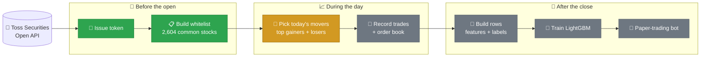
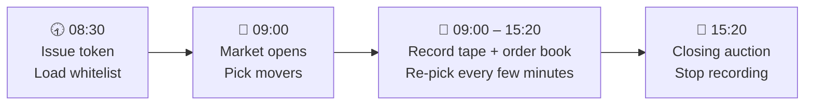
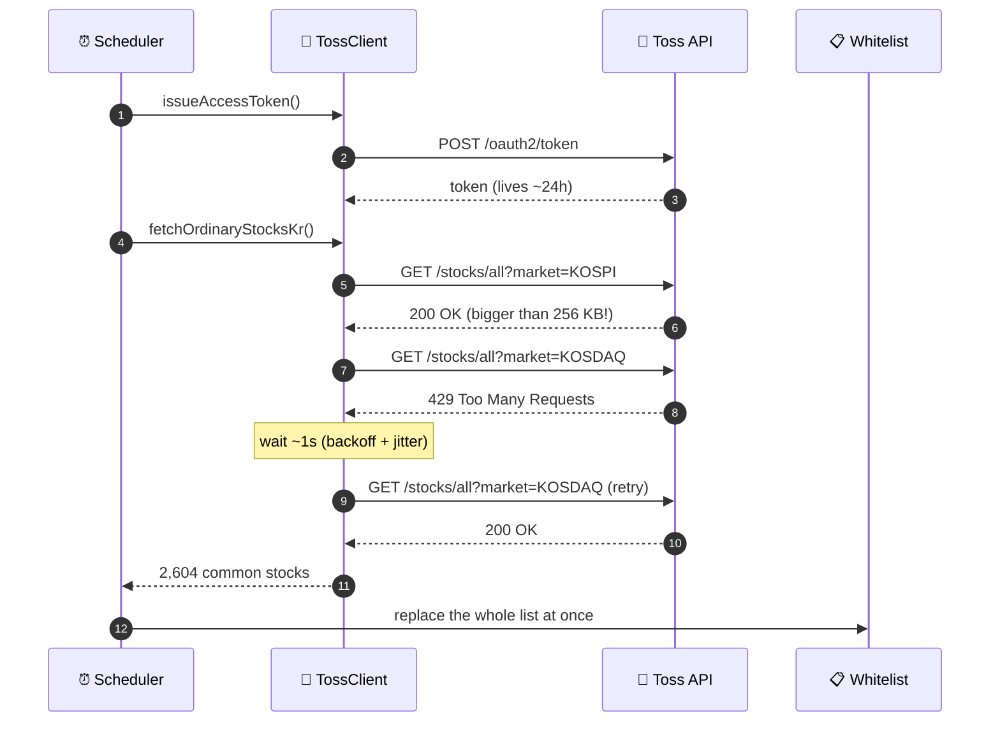
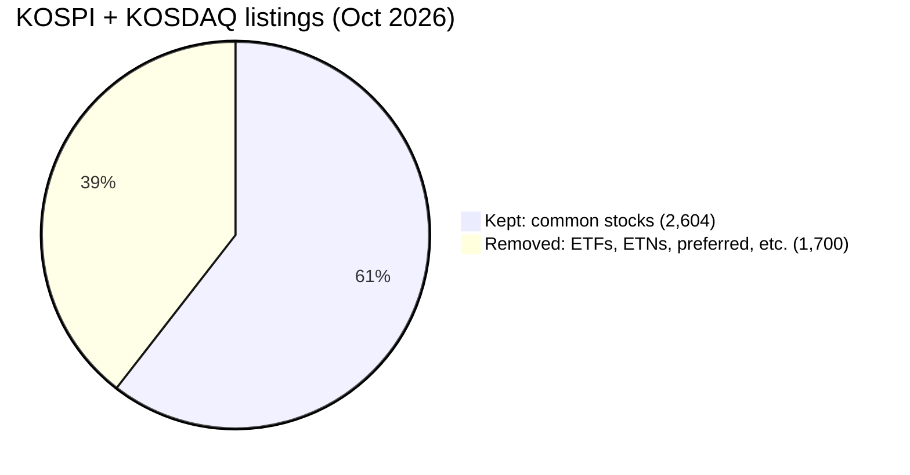

# 📈 tapewatch

> **Watch the tape. Learn the bounce.**
> A Spring Boot app that records every trade and order book change of Korean stocks that are moving fast today — and turns it into data for a model that guesses the next short-term move.


> 🚧 **Status (Oct 2026):** Step 1 of 5 is done — pre-market prep runs against the **real** Toss Securities API.
> ⏭️ **Next:** picking today's top movers.

---

## 🤔 What is this?

Every trading day, a handful of Korean small-cap stocks jump or drop **10–30%**.
`tapewatch` is built to answer one simple question about them:

> ❓ **"If I buy this stock right now, will it go up about +3% in the next 30 minutes?"**

To answer that, it:

1. 🎯 **Picks** today's biggest movers (top gainers + top losers)
2. 📡 **Records** every trade (the "tape") and the order book, live
3. 🧮 **Builds** training rows: what the tape looked like ➜ what happened next
4. 🌲 **Trains** a model (LightGBM) to guess the next move
5. 🤖 **Tests** it with a paper-trading bot (no real money)

---

## 💡 Why build this?

- ⏱️ **Fast moves need fast data.** Most surges start and end within minutes. One-minute candles are already too late — you need every single trade and the order book.
- 💾 **Old tick data is not for sale here.** The Toss API gives live data, not history. The only way to get a dataset is to **record it myself, starting today.** Every recorded day = one more day of training data.
- 🧑‍💻 **It joins my two worlds.** I spent years building trading systems (matching engines, settlement). Now I study machine learning. This project needs both: real-time market plumbing **and** ML.

---

## 🗺️ The big picture



🟩 Done · 🟨 In progress · ⬜ Planned

---

## ⏰ A trading day (Korea time)



🌎 I live in California, so the scheduler is pinned to `Asia/Seoul`. 08:30 KST is 16:30 in California (15:30 in winter) — and Korea has no daylight saving time.

---

## 🎯 What the model learns

Each row is one moment in time for one stock.

| | Example |
|---|---|
| ⏱️ **Moment** | 10:00, price = 10,000 KRW |
| 👀 **What it sees** | the tape + order book **before** 10:00 |
| ✅ **Label = 1** | price touches **10,300 KRW (+3%)** before **10:30** |
| ❌ **Label = 0** | it doesn't |

*(Exact numbers are still being tuned.)*

**🧪 Planned features**

- 🔼🔽 **Buy vs. sell pressure** — tick rule: a trade above the last price counts as a buy, below counts as a sell
- 🪜 **Lookback ladder** — buy / sell / total volume over 1s, 10s, 30s, 1m, 5m, 10m, 20m, 30m, 1h
- 📊 **Volume share** — e.g. 50,000 shares in the last 30s ÷ 1,000,000 shares today = **5%**
- ⚖️ **Order book balance** — how much is waiting to buy vs. to sell

Two separate models: 🚀 one for **top gainers** (does the run keep going?) and 🪂 one for **top losers** (does it bounce?).

---

## ✅ Progress

- [x] 🔑 OAuth2 token from Toss (one token per client, lives ~24h)
- [x] 📋 Whitelist of KOSPI + KOSDAQ common stocks
- [x] 🏆 Top gainers / top losers rankings
- [x] 🔁 Retry on `429 Too Many Requests` (backoff + jitter)
- [x] ⏰ Pre-market scheduler at 08:30 KST
- [x] 🧪 Integration tests against the **real** Toss API
- [x] 🎯 Pick today's movers (±10%, add-only, up to 45 per side)
- [ ] 📡 WebSocket recorder for trades + order book
- [ ] 🧮 Row builder + labels
- [ ] 🌲 LightGBM training
- [ ] 🤖 Paper-trading bot

---

## 🔄 How pre-market prep works



### 📋 What the whitelist keeps



| Market | All listings | Common stocks kept |
|---|---:|---:|
| KOSPI | 2,479 | 803 |
| KOSDAQ | 1,825 | 1,801 |
| **Total** | **4,304** | **2,604** |

Most of what gets removed sits on KOSPI — that's where ETFs and ETNs are listed.

---

## 🔍 Lessons so far

Real bugs that **real-API tests** caught (mocks would have missed every one):

1. 📦 **The stock list is too big.** WebClient only buffers 256 KB by default. The full KOSPI list is bigger, so the call crashed *after* a `200 OK`. ➜ Raised the limit to 10 MB.
2. 🚦 **Rate limits hit fast.** Even two calls in a row got `429`. ➜ Retry only on 429, waiting ~1s → 2s → 4s with jitter. Other errors (401, 5xx, timeouts) fail right away.
3. 🔑 **One token at a time.** A new Toss token kills the old one right away. ➜ Issue once before the open (~24h life is plenty).
4. 🌎 **Time zones.** I'm in California; the market is in Korea. ➜ Cron pinned to `Asia/Seoul`, with a test that reads the **real** `@Scheduled` annotation and checks the next run time.
5. 🌙 **The market doesn't end at 15:30.** The last Samsung trade I pulled was at **19:59:59 KST** (after-hours venue). ➜ The recorder can't assume 09:00–15:30.
6. 🔢 **Rates are fractions.** `changeRate = -0.2076` means **−20.76%**, so filters use `-0.29 … -0.10`, not `-29 … -10`.

---

## 🧰 Tech stack

| Area | Choice |
|---|---|
| ☕ Language | Java 21 |
| 🌱 Framework | Spring Boot 4.1, `@Scheduled` |
| ⚡ HTTP | WebFlux `WebClient` (Reactor) |
| 📡 Live data | Toss WebSocket *(planned)* |
| 🧪 Tests | JUnit 5 + AssertJ, real-API integration tests |
| 🌲 Model | LightGBM *(planned)* |

---

## 📁 Project layout

```
src/main/java/io/github/oscarleetech/tapewatch
├── client/      🔌 TossClient — token, REST calls, 429 retry
├── dto/         📦 Records for Toss responses
├── scheduler/   ⏰ PreMarketScheduler — 08:30 KST prep
└── universe/    🎯 Which stocks to watch (whitelist → movers)
```

---

## 🚀 Run it yourself

You need **Java 21** and a **Toss Securities Open API** client ID + secret.

```bash
git clone https://github.com/oscarlee-tech/tapewatch.git
cd tapewatch
cp .env.example .env      # fill in TOSS_CLIENT_ID and TOSS_CLIENT_SECRET
./gradlew bootRun
```

```bash
./gradlew test            # integration tests call the real API
                          # (skipped if .env is missing)
```

⚠️ Toss allows **one token per client**. Running the tests while the app is running will log the app out.

---

## 📢 Disclaimer

Personal research project. **Not investment advice.** It only **reads** market data — it does not place orders.

---

## 👋 About me

**Oscar Lee** — backend engineer with ~12 years in low-latency systems, including matching engines and settlement at Bithumb (a top Korean crypto exchange). Now studying ML at Georgia Tech (OMSCS).

🔗 [LinkedIn](https://www.linkedin.com/in/hyoslee) · 🐙 [GitHub](https://github.com/oscarlee-tech)